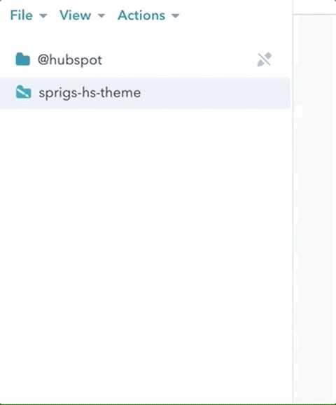

# SPRIGS_ Hubspot developer assignment

## Goal
The goal of this assignment is to implement the hubspot theme `sprigs-hs-theme` using HubSpots CLI and SCSS!

## Requirements

Make sure the following requirements are installed on your system:
- [Git](https://git-scm.com/downloads)
- [Node.js](https://nodejs.org/en/download/)
- Hubspot CLI
  - Read the hubspot official guide on [getting started](https://developers.hubspot.com/docs/cms/guides/getting-started) and how to set up [Local development CLI](https://developers.hubspot.com/docs/cms/developer-reference/local-development-cli)

- [VS Code](https://code.visualstudio.com/)
- [HubSpot VS Code Extension](https://marketplace.visualstudio.com/items?itemName=HubSpot.hubl)

## Setting up
Clone this repository, go inside projects directory and remove git
``` bash
# Clone the repo and unlink the git account
git clone https://github.com/SPRIGS/hs-hiring-assignment.git
cd hs-hiring-assignment

# Mac OS users:
rm -rf .git

# Windows users
rmdir /s /q .git

```

Install dependencies
``` bash
npm install
```

Make sure youre logged in to the right sandbox portal on your default browser. Then link the current project with your portal by running
```
hs init
```
and follow the steps there (refer to the getting started document above).

If everything went well, there should be a `hubspot.config.yml` at the root of the project looking something like this
``` yml
defaultPortal: DEV
portals:
  - name: DEV
    portalId: <PORTAL-ID>
    authType: personalaccesskey
    auth:
      tokenInfo:
        accessToken: >-
          <ACCESS-TOKEN>
        expiresAt: '2022-01-19T02:41:01.599Z'
    personalAccessKey: >-
      <PERSONAL-ACCESS-KEY>
```

Make sure that `defaultPortal` is set on the first line.

Upload the theme to your SandBox portal running the command
``` bash
hs upload sprigs-hs-theme sprigs-hs-theme
```

Go to design-manager in your portal and lock the theme folder to avoid accidental editing:

[](lock-theme-folder.gif)
## Development

Once youre ready to start developing, you can run the command ```npm run watch``` which does two things:
1. Watches for SCSS changes on theme files, and compiles them in the same directory.
2. Listens for changes and uploads them to the portal (runs `hs watch sprigs-hs-theme sprigs-hs-theme` on the background)

In the modules directory `/sprigs-hs-theme/modules` you will find the following modules:
- CTA banner
- Divider
- Main banner
- Media and Accordion
- Page links
- Quote highlight
- Quote
- Site footer
- Site navigation
- Text and image*
  
All the modules are empty, exept for the `text and image` one, which you can delete, or use as a reference.

Refer to the figma file sent to your email and develop the modules.

There is already a 'Home' template which has all the modules listed.

Figure out what styling is local (isolated per module) and what goes in the global css (`/sprigs-hs-theme/css/global.scss`)

Use [BEM](http://getbem.com/introduction/) for class names.